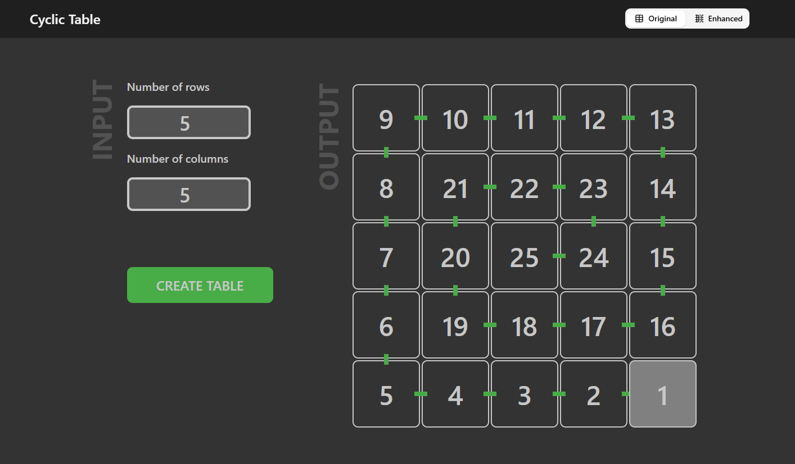
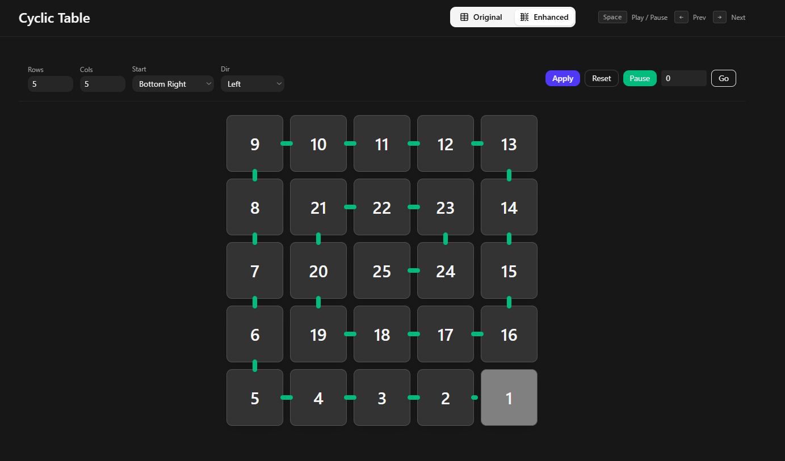

# Cyclic Table

A small interactive Next.js app that generates and visualizes "cyclic" numbered tables (spiral or center-out layouts). The UI contains two views:

-   Original: a stylized static-ish visual with simple controls (`OriginalCyclic`).
-   Enhanced: an interactive player with animation, keyboard controls and configuration (`EnhancedCyclic`).

The app exposes a server API that builds the cyclic matrix, and the client-side components fetch that matrix and render connectors between adjacent numbers.

Tech highlights

-   Next.js (app router)
-   React 19 (client components)
-   Tailwind CSS
-   Radix UI Tabs
-   Axios for client API calls

## Features

-   Generate numbered tables in spiral or center-out orders.
-   Configurable start location (top-left, top-right, bottom-left, bottom-right, center).
-   Direction and rotation options for center-start layouts.
-   Animated reveal with keyboard shortcuts (Space = play/pause, ←/→ = prev/next).
-   Small, dependency-light codebase for experimentation.

## Preview

Original view:



Enhanced view (interactive):



## API

Base endpoint (app router):

-   GET /api/cyclic/:rows/:columns

Query parameters:

-   corner: one of `tl`, `tr`, `bl`, `br`, `cl`, `cr`, `ct`, `cb` (default `br`).
-   dir: `up` | `down` | `left` | `right` (default `left`).
-   rotation: `cw` | `ccw` (default `cw`).

Constraints enforced on the server:

-   rows and columns must be numbers between 1 and 10 (inclusive). Requests outside this range return HTTP 400 with an explanatory message.

Response shape

-   The API returns a 2D array of cells. Each cell object has the following shape (TypeScript type located at `src/app/api/cyclic/route.ts`):

    -   cellNumber: number
    -   cellUp: boolean
    -   cellDown: boolean
    -   cellLeft: boolean
    -   cellRight: boolean
    -   cellBgColor: string (CSS color)

Example curl (PowerShell):

```powershell
curl "http://localhost:3000/api/cyclic/5/5?corner=br&dir=left&rotation=cw" | ConvertFrom-Json
```

Client helper

-   `src/services/CyclicService.ts` exposes a convenience `get(rows, columns, opts)` that returns an Axios promise for the endpoint above.

## Components

-   `src/app/page.tsx` — main page, uses Radix `Tabs` to switch between the two visualizations.
-   `src/components/OriginalCyclic.tsx` — original UI with forms and basic animation.
-   `src/components/EnhancedCyclic.tsx` — richer UI: keyboard controls, play/pause, speed, hover tooltips and connectors.
-   `src/components/ui/tabs.tsx` — small wrapper around `@radix-ui/react-tabs` used by the layout.

Design notes

-   The client expects the API to return the adjacency booleans (cellUp/cellDown/…) so it can draw connectors between numbers.

## Development

Install dependencies and run the app in development mode:

```powershell
npm install
npm run dev
```

Open http://localhost:3000 in your browser.

Available npm scripts (from `package.json`):

-   `dev` — start Next.js dev server
-   `build` — build for production
-   `start` — start built production server
-   `lint` — run ESLint

Notes

-   The project uses Next.js 15 and React 19. Tailwind and a few UI helpers are present in the repo.

## Usage examples

Keyboard controls in the Enhanced view

-   Space - play / pause
-   ArrowRight - advance one number
-   ArrowLeft - go back one number

## Contributing

Small project — open an issue or PR. Please run the linter before pushing.
