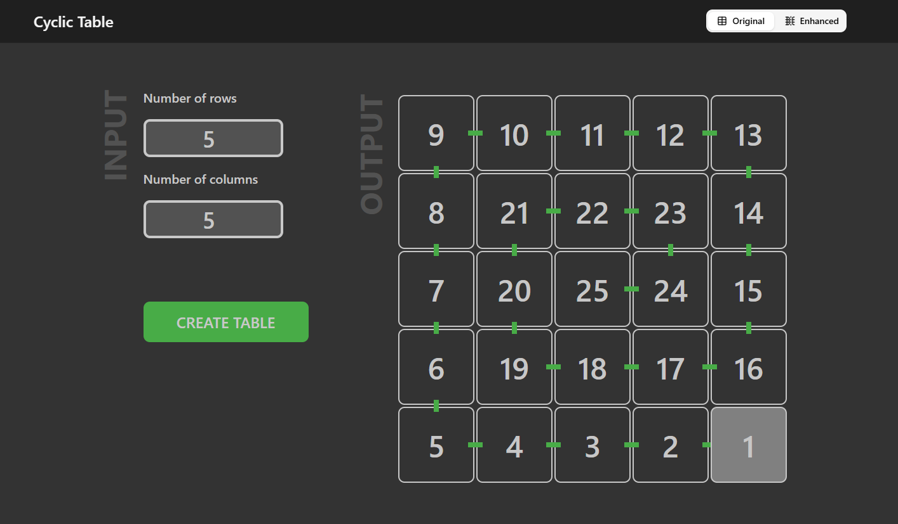
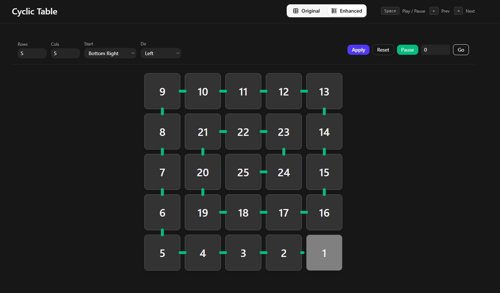
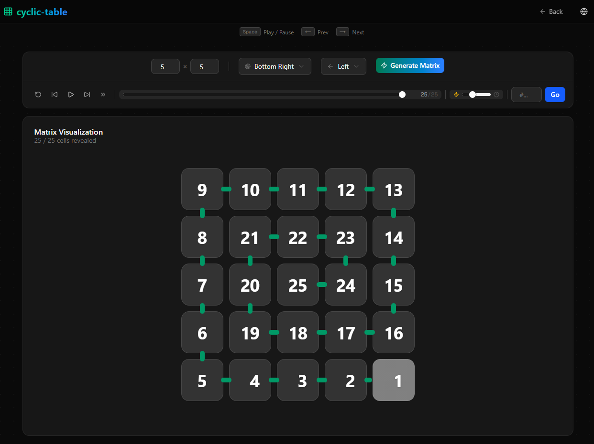

# Cyclic Table

The app exposes a server API that builds the cyclic matrix, and the client-side components fetch that matrix and render connectors between adjacent numbers.

Tech highlights

- Next.js 16
- React 19
- shadcn/ui
- Tailwind CSS

## Features

- Generate numbered tables in spiral or center-out orders.
- Configurable start location (top-left, top-right, bottom-left, bottom-right, center).
- Direction and rotation options for center-start layouts.
- Animated reveal with keyboard shortcuts (Space = play/pause, ←/→ = prev/next).
- Small, dependency-light codebase for experimentation.
- Supported language: English and Croatian

## Implementations

The project contains multiple implementations / UI variants so you can compare approaches or iterate quickly:

- `v0` — Original static-ish visual with simple controls. Implemented in [src/components/CyclicV0.tsx](src/components/CyclicV0.tsx).
- `v1` — Enhanced interactive with animation, keyboard controls and configuration. Implemented in [src/components/CyclicV1.tsx](src/components/CyclicV1.tsx).
- `v2` — Experimental/alternate rendering and performance tweaks. Implemented in [src/components/CyclicV2.tsx](src/components/CyclicV2.tsx).

Each variant has a corresponding route under [src/app/](src/app/) (`/v0`, `/v1`, `/v2`) for quick previewing.

## Preview

V0 view:



V1 view:



V2 view:



## API

Base endpoint (app router):

- GET `/api/cyclic/:rows/:columns`

Query parameters:

- corner: one of `tl`, `tr`, `bl`, `br`, `cl`, `cr`, `ct`, `cb` (default `br`).
- dir: `up` | `down` | `left` | `right` (default `left`).
- rotation: `cw` | `ccw` (default `cw`).

Constraints enforced on the server:

- rows and columns must be numbers between 1 and 10 (inclusive). Requests outside this range return HTTP 400 with an explanatory message.

Server implementation note: the server-side route that implements this is at [src/app/api/cyclic/route.ts](src/app/api/cyclic/route.ts) and performs the input validation and matrix construction.

Response shape

- The API returns a 2D array of cells. Each cell object has the following shape (TypeScript type located at `src/app/api/cyclic/route.ts`):
    - cellNumber: number
    - cellUp: boolean
    - cellDown: boolean
    - cellLeft: boolean
    - cellRight: boolean
    - cellBgColor: string (CSS color)

Example curl (PowerShell):

```powershell
curl "http://localhost:3000/api/cyclic/5/5?corner=br&dir=left&rotation=cw" | ConvertFrom-Json
```

Client helper

- `src/services/CyclicService.ts` exposes a convenience `get(rows, columns, opts)` that returns an Axios promise for the endpoint above.

Client usage example (Axios)

```ts
import CyclicService from "./src/services/CyclicService";

// returns a promise that resolves to the 2D cell matrix
const resp = await CyclicService.get(5, 5, { corner: "br", dir: "left", rotation: "cw" });
console.log(resp.data);
```

## Getting Started

Install dependencies using your preferred package manager:

```bash
npm install
# or
bun install
```

Start the development server:

```bash
npm run dev
# or
bun dev
```

Open http://localhost:3000 in your browser.

Available npm scripts (from `package.json`):

- `dev` — start Next.js dev server
- `build` — build for production
- `start` — start built production server
- `lint` — run ESLint

Notes

- The project uses Next.js 16 and React 19. Tailwind and a few UI helpers are present in the repo.

Quick start

```powershell
npm install
npm run dev
# open http://localhost:3000
```

## Usage examples

Keyboard controls in the Enhanced view

- Space - play / pause
- ArrowRight - advance one number
- ArrowLeft - go back one number
